# Travel Country Selector
The purpose of this app is to assist users with travel research by choosing which country is best to travel to based on travel month, seasons, and activities and compile them into a favourite list. 

## Github and Trello Links

Github:
https://github.com/Sky12072/terminal-assessment.git

Trello:
https://trello.com/b/pix4Kkhx/terminal-app-assessment

## Features

1. User input and display result
- Ask the user's name
- Ask the user to choose which month they want to travel in
- Ask the user to choose which season they want to travel in
- Ask the customer to choose any indoor or outdoor activity
- The app will display list of countries that are in a particular month and chosen weather season.
- At the end, the app will also display indoor or outdoor activity ideas.

Within the 'questions' method, while-loop is used to loop over - 'as long as countries search is not available or false'. The loop uses 'seasoncheck' variable name is used in this scope only. Global variable '$dataresult' is used to be accessed by output method and  '$season' is used to be accessed by 'add_to_wishlist' method. 

2. Wishlist
- The user also will be able to save their favourite countries in to a wish list.
This feature uses 'add_to_wishlist' method. Within this method, while-loop is used to iterate select countries for wishlist-question if user selects nothing. Variable scope used such as 'countries_result' to add multiple countries in a storage. Global variable '$wishlist' is used to share information to other methods needed. Error handling is used specifically in this method to identify data-type conversion error. 

3. Deletion
- The user will be able to delete countries in their wishlist if they prefer to. In the 'delete' method, while-loop is used with purpose, as long as user choose to delete, the app will keep re-confirming if the user would like to delete another country until the user decided not to and variable scope 'deletequestion' is used for this purpose. This method also contains global variable '$wishlist' to retrieve information from the 'add_to_wishlist' method. Error handling is used specifically in this method to identify data-type conversion error. 

The user will be able to start over and repeat the first steps or end the app if they are done.

When the user is done, the app will display the wish list.

## Implementation Plan

1. Build database
checklist:
- research most travelled countries around the world. Duration: 1 hour.
- research which countries are in certain season in particular months. Duration: 2 hours.
- research activity ideas. Duration: 1 hour.
- research and implement how do I put all these data in ruby with the right syntax and accessible. Duration: 4 hours.
- Implement the plan. Duration: 4 hours.

2. Build questions feature
checklist:
- research gems. Duration: 4 hours.
- develop the logic. Duration: 1 hour.
- develop pseudocode. Duration: 1 hour.
- research the proper way to call the database from inputs. Duration: 2 hours.
- research the proper syntax, class type and data type. Duration: 1 hour.
- Implementation. Duration: 4 hours.

3. Build wishlist feature
checklist:
- develop the logic. Duration: 1 hour.
- develop the pseudocode. Duration: 1 hour.
- research the proper syntax, class type and data type. Duration: 1 hour.
- Implementation. Duration: 4 hours.
- Double checking. Duration: 1 hour.

4. Build deletion feature
checklist:
- develop the logic. Duration: 1 hour.
- develop the pseudocode. Duration: 1 hour.
- research the proper syntax, class type and data type. Duration: 1 hour.
- Implementation. Duration: 4 hours.
- Double checking. Duration: 1 hour.

Project management platform used is trello. 
Screenshots:

Screen Shot 2022-04-13 at 10.21.40 pm
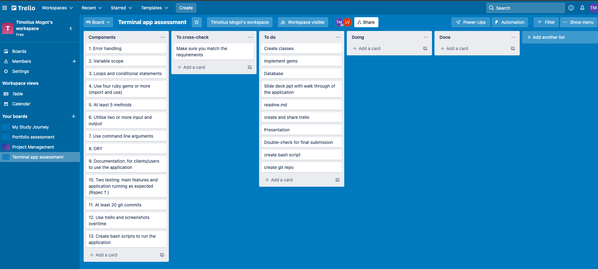

Screen Shot 2022-04-13 at 10.22.56 pm
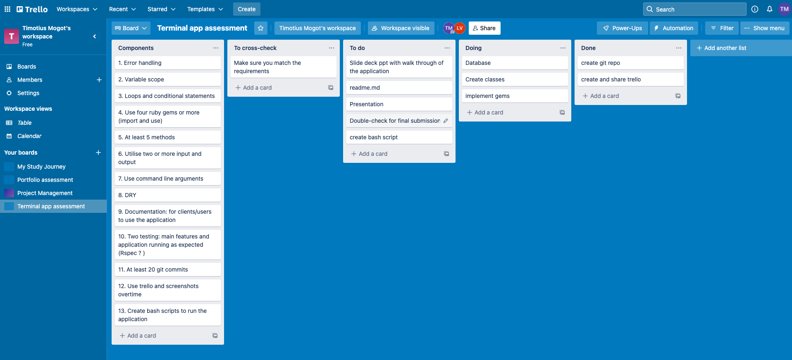

Screen Shot 2022-04-18 at 3.06.32 pm
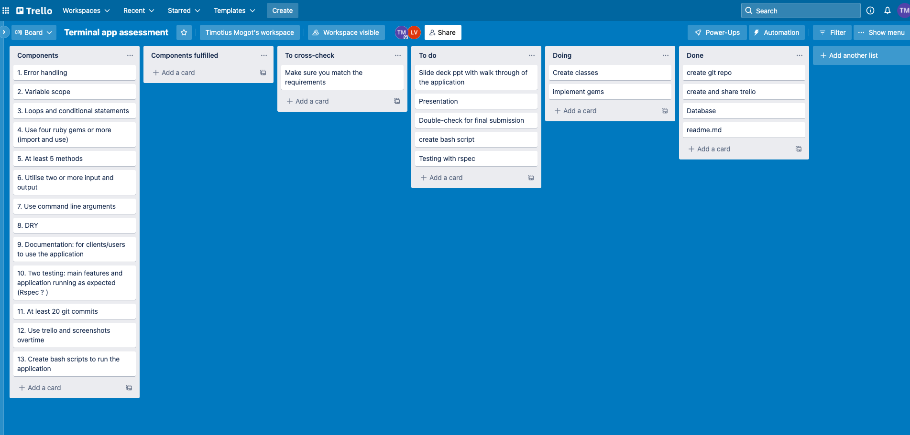

Screen Shot 2022-04-18 at 3.12.47 pm
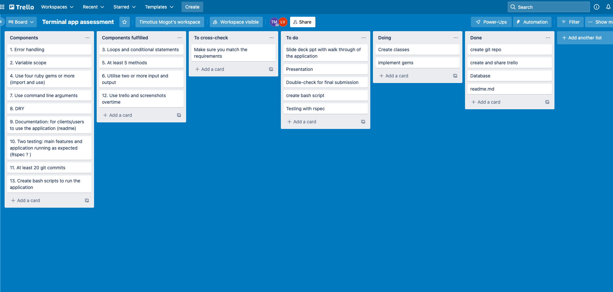

Screen Shot 2022-04-18 at 3.18.26 pm
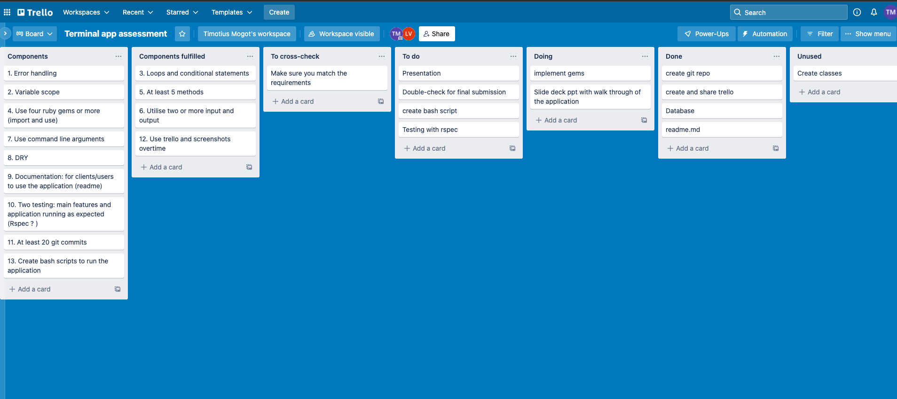

Screen Shot 2022-04-19 at 9.30.37 am
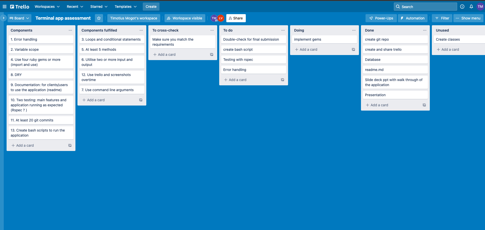

Screen Shot 2022-04-19 at 9.32.38 am
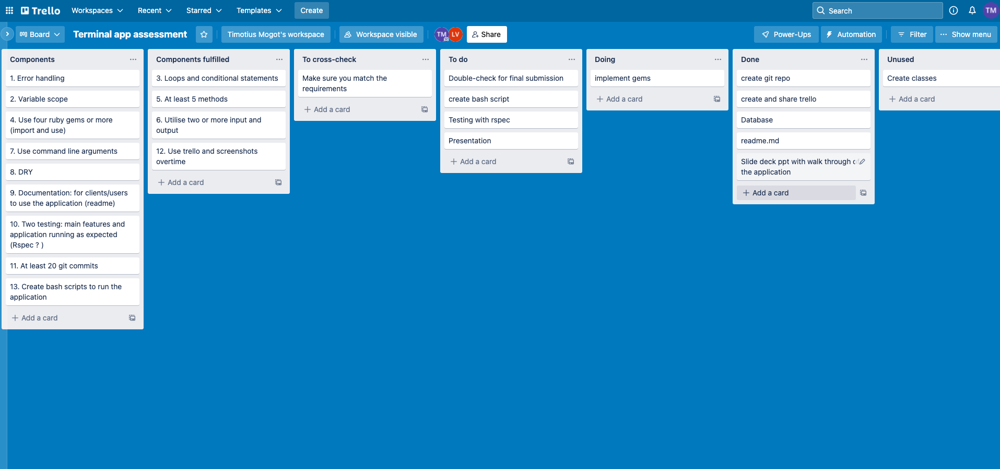

Screen Shot 2022-04-19 at 5.40.58 pm
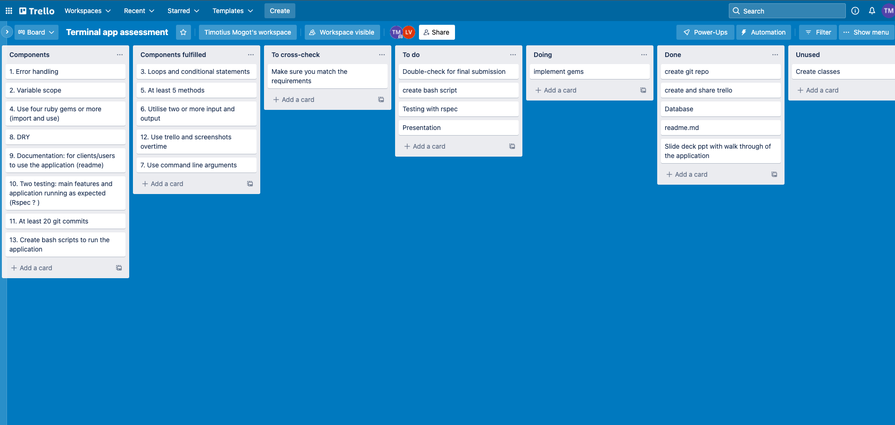

Screen Shot 2022-04-20 at 10.26.19 am
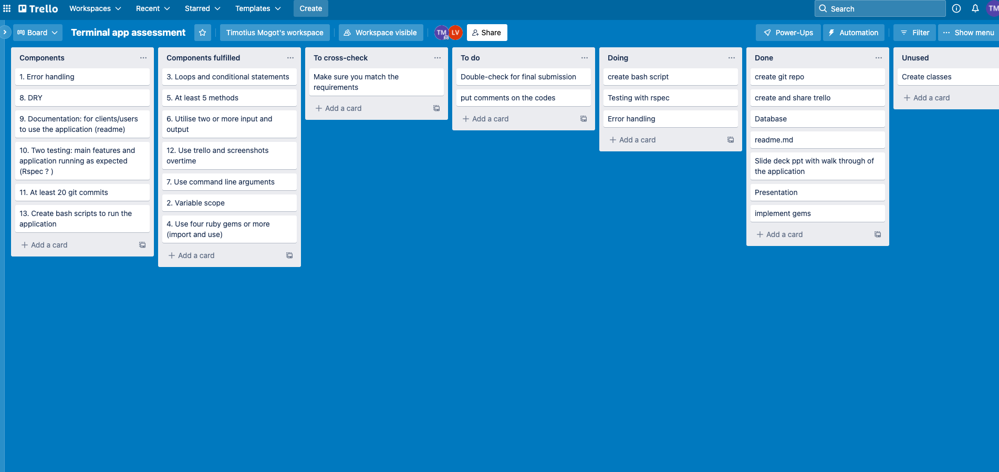

Screen Shot 2022-04-20 at 10.53.17 am
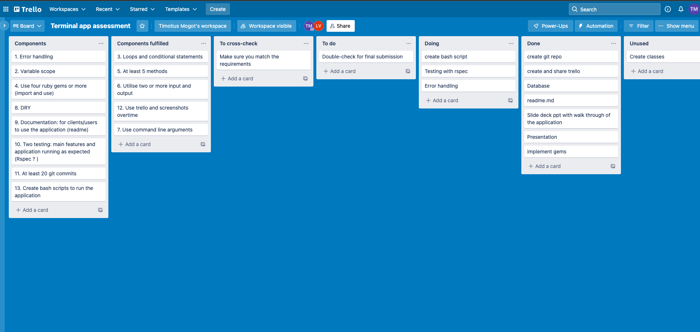

Screen Shot 2022-04-20 at 1.55.08 pm
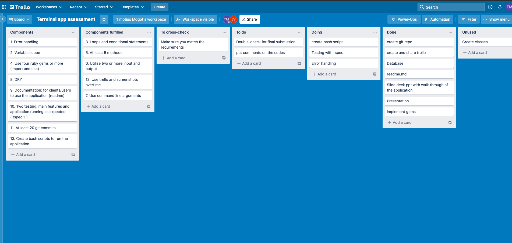

Screen Shot 2022-04-21 at 1.28.38 am
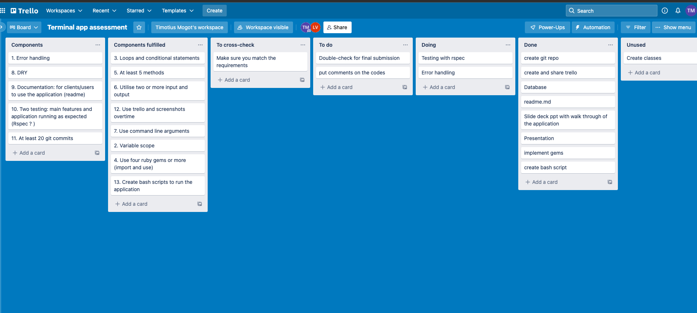

Screen Shot 2022-04-21 at 10.55.21 am
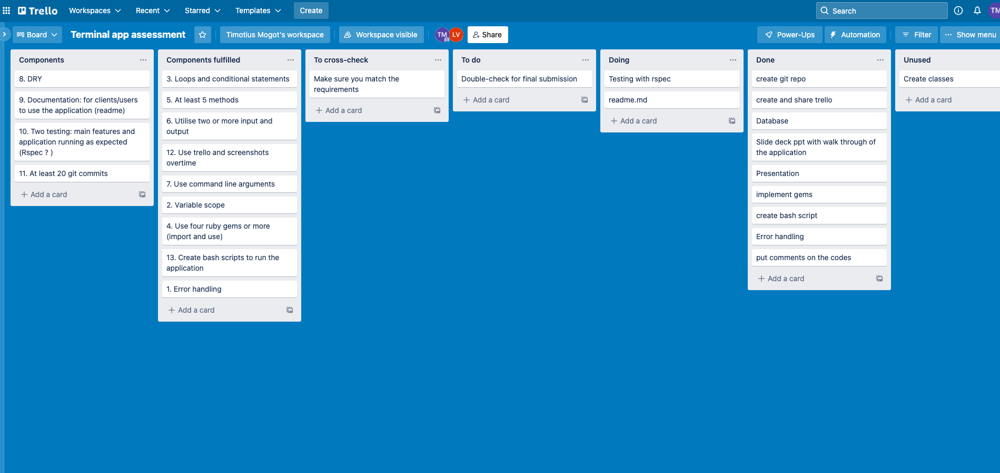

Screen Shot 2022-04-21 at 3.01.51 pm
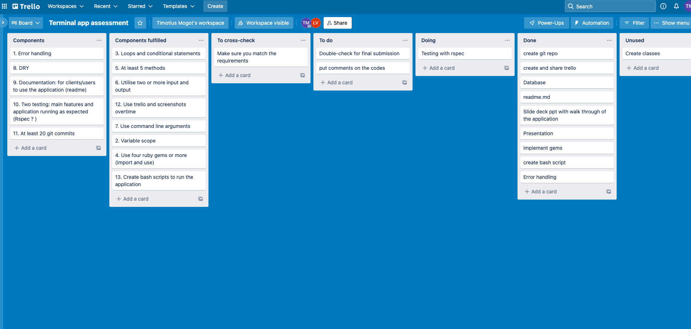

Screen Shot 2022-04-23 at 1.02.49 am
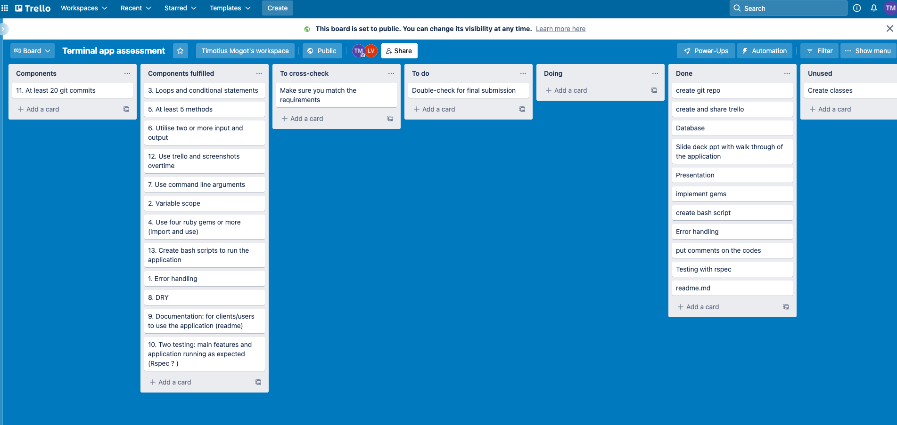

## Installation and How to use this app

The app is very user friendly. The user simply to follow the prompts in every step of the way in order to achieve the outcome. At the end of the app, the user will be presented the result of a wishlist that contains list of favourite countries chosen by the user. 

To install the app, the user needs to be in the bash terminal and type in:
`./run_app.sh` and then press enter. 
By doing this, the app will automatically download the necessary data or gems for the app to be able to run.

### Dependencies (Gems)
Gems used for this application are:
- tty-prompt
- artii
- rspec
- pastel
- colorize
- tty-progressbar

### System requirements
- Windows/Mac/Linux

### Command line arguments
Command line arguments are special feature which only executes when you type a special keyword next to ruby execution keyword (`ruby main.rb`).

Available command line arguments are:
- Starting up the app with your name: `ruby main.rb Tim`
- Display 'about app' documentation: `ruby main.rb -about`

## List of Methods

### Nameinput method

To store user input for name and command line arguments

### Greetings method

Represents greetings message

### Questions method

Questions method represents inputs for month, season and activities. 

### Output method

Output methods represents a method to display matched country, season and activities from questions method

### Add_to_wishlist method

Add_to_wishlist method represents a method to add selected countries and save them in a wishlist. 

### Delete method

Delete method represents a method to delete countries in wishlist.

### Indoor_outdoor method

To display indoor or outdoor activities

### Finish method

Finish method represents a method to display countries in wishlist at final stage.

### Goodbye method

Goodbye method represents a method to display farewell message.

### Progressbar method

To display progessbar that uses tty-progressbar gem.

